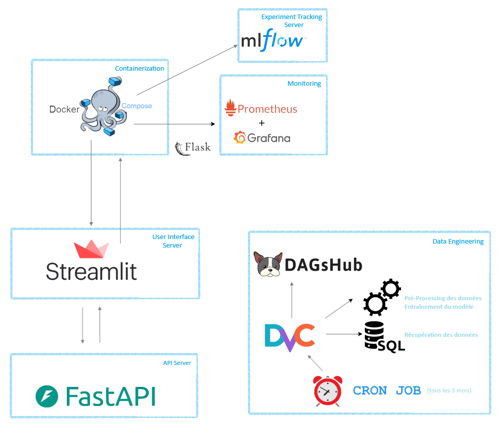

# CO2 - DataScientest Project
### Prédiction des émissions de CO2 d'un Véhicule Léger - Déploiement du Project
#### Pour DataScientest - Soutenance de projet - Parcours DevOps


Ce projet vise à déployer une solution de Machine Learning dans le respect des règles du cycle de vie DevOps. Nous vous expliquons ici l'ensemble des étapes à suivre afin de réaliser tout le parcours du jeu de données à l'utilisateur final.

<div align="center">
  <picture>
    
  </picture>
</div>
</BR>
Nous vous présentons ce projet qui vise à automatiser la récupération d'un dataset, à entraîner un modèle puis le mettre à disposition via une plateforme API. Notre solution permet également la supervision et le surveillance de toutes les phases de notre système. 

L'application finale permet la prédiction des émissions de CO₂ (WLTP) d'un véhicule à partir de caractéristiques techniques (masse, la cylindrée, la puissance, cylindrée, système de réduction des émissions, la consommation de carburant et le type de carburant). Nous proposons une étude où plusieurs modèles de Machine Learning peuvent être entraînés afin de comparer les résultats, soit les algorithmes de Forêt d'arbres décisionnels (Random Forest), Régression Linéaire et Méthode des K plus proches voisins (KNN).
[avec et sans inclusion des informations sur les marques.]

## Table des matières

- [Présentation du Projet](#présentation-du-projet)
- [Structure du Projet](#structure-du-projet)
- [Architecture](#architecture)
- [Installation](#installation)
- [Utilisation](#utilisation)
- [Téléchargement du Dataset](#téléchargement-du-dataset)
- [Pré-processing](#pré-processing)
- [Modèles et Données](#modèles-et-données)
- [Automatisation](#automatisation)
- [Axes d'Amélioration](#axes-damélioration)
- [Licence](#licence)
- [Contributions](#contributions)

## Présentation du Projet

Face aux enjeux climatiques et aux régulations strictes sur les émissions de CO₂, il est crucial de développer des outils permettant d'estimer l'impact environnemental des véhicules. Ce projet a pour objectifs :
- de récupérer un dataset distant,
- de réaliser le pré-processing nécessaire,
- d'entraîner un modèle,
- d'évaluer le modèle,
- de déployer le nouveau modèle,
- de surveiller les métrics

## Structure du Projet

```plaintext
.
├── README.md
├── READ_ME
├── __pycache__
│   ├── config.cpython-312.pyc
│   └── streamlit.cpython-312.pyc
├── app.log
├── config.py
├── data
│   ├── processed
│   ├── raw
│   └── readme.md
├── dvc.lock
├── dvc.yaml
├── instructions_dvc
├── metadata
│   └── metadata.json
├── mlruns
│   ├── 0
│   └── models
├── models
│   ├── RandomForest_Final.pkl
│   └── columns_list.pkl
├── notebooks
│   ├── modelisation.ipynb
│   ├── preprocessing.ipynb
│   └── recup_raw_data.ipynb
├── outputs
│   └── metrics.json
├── requirements.txt
├── src
│   ├── __init__.py
│   ├── __pycache__
│   ├── data
│   ├── logging_script.py
│   ├── modelisation.py
│   ├── models
│   └── utils
└── streamlit.py
```
       
## Architecture

|     Application    | Framework |
|-------------------:|-----------|
|   Automatisation   | Cron Job  |
|     Versionning    | DVC       |
|      Repository    | DagsHub   |
|   Contenarisation  | Docker    |
| Suivi Entraînement | MLFlow    |
|     Monitoring     | Prometheus|
|  Tableau de bord   | Grafana   |
|     Interface      | Streamlit |

<div align="center">
  <picture>
    
  </picture>
</div>
</BR>

## Installation

**1. Cloner le dépôt :**

       git clone https://dagshub.com/tiffany.dalmais/OCT24_MLOPS_CO2.git
       cd NOV24-BDS-CO2

**2. Créer un environnement virtuel (optionnel, mais recommandé) :**

       python -m venv venv
       source venv/bin/activate   # Sur Windows : venv\Scripts\activate

**3. Installer les dépendances :**

       pip install -r requirements.txt

**4. Installer DVC :**

       python3 -m pip install --upgrade pip # Mise à jour de la bibliothèque des paquets Python
       pip install dvc

**5. Installer MLflow et dagshub :**

       python3 -m pip install mlflow dagshub # Installation des deux applications


**6. Configurer l'authentification (optionnel mais utile pour éviter de ressaisir ses identifiants à chaque fois) :**
       a. Ouvrir un terminal et créer/modifier le fichier ~/.netrc :

       nano ~/.netrc

    b. Ajouter les lignes suivantes au fichier : 

       machine dagshub.com # Nom du serveur distant
       login nom_utilisateur # Nom d'utilisateur
       password token_dagshub # Token d'authentification

    c. Enregistrer les modifications et quitter l'éditeur de texte : 

       Ctrl+O, Enter, Ctrl+X

    d. Sécuriser le fichier : 

       chmod 600 ~/.netrc

**7. Exécuter la pipeline pour reproduire les étapes :**

      dvc repro --force

**8. Gestion des commits et des push :**
En cas de modification de la pipeline et/ou des scripts : 
    a. Ajouter et committer les modifications (code, dvc.yaml, dvc.lock, etc.) :
    
        git add .
        git commit -m "Description du commit"

    b. Pousser le code vers le remote Git :
    
        git push origin main
        git push github main

    c. Pousser les données volumineuses via DVC :

        dvc push --force
       
## Utilisation

**Les commandes suivantes doivent être exécutées depuis le dossier source.**

       cd NOV24-BDS-CO2

**Lancer le serveur MLFlow :**

       mlflow server # Commande de base

       # Si vous rencontrez un problème de compatibilité lancer le serveur avec la configuration suivante
       mlflow server --backend-store-uri sqlite:///mlflow.db --default-artifact-root ./mlruns --host 0.0.0.0 --port 5000 

*L'interface de gestion du serveur se trouve à l'adresse [[http://localhost:5000](http://localhost:5000)].*
       
**Lancer le serveur FastAPI :**

       uvicorn api:app

*L'interface de gestion du serveur se trouve à l'adresse [[http://localhost:8000/docs](http://localhost:8000/docs)].*

**Pour lancer l'application Streamlit :**

       streamlit run app.py

*L'application s'ouvrira dans votre navigateur à l'adresse [http://localhost:8501](http://localhost:8501).*

## Téléchargement du Dataset

La récupération de notre dataset s'effectue au travers une requête SQL sur le serveur de `https://discodata.eea.europa.eu/` afin de récupérer les informations nécessaires à l'entraînement de notre modèle. </BR>
Ces informations sont contenues dans les colonnes : Year, Mk, Cn, M (kg), Ewltp (g/km), Ft, Ec (cm3), Ep (KW), Erwltp (g/km) et Fc. </BR>
Pour cette étape nous utilisons le script `recup_raw_data.py` situé dans le dossier `src/data/`. </BR>
Un fichier est alors créé sous un nom horodaté soit par exemple `DF_Raw_20250321_095913.csv` (`DF_Raw_DATE_HEURE.csv`). </BR>
Un fichier de métadonnées au format JSON est également créé afin de sauvegarder le nom du fichier de sortie.</BR>
</BR>
Attention, le dataset en ligne a une fréquence de mise à jour annuel, si vous souhaitez télécharger la dernière mise à jour  nous vous conseillons de consulter `https://discodata.eea.europa.eu/` en sélectionnant le serveur `CO2Emission`, puis la base `latest`.


## Pré-processing

Le prétraitement, communément appelé pré-processing, est réalisé via le script `preprocessing.py` situé dans le dossier `src/data/`. </BR>
Un fichier de sortie est alors créé contenant le dataset réduit pour notre usage et l'entraînement de notre modèle. </BR>
Il sera présent sous un nom de fichier formaté soit par exemple `DF_Raw_20250321_095913.csv` (`DF_Processed_DATE_HEURE.csv`), le fichier JSON de métadonné (`metadata.json`) est également modifié afin d'intégrer le nom du fichier prêt pour l'entraînement de notre modèle.


## Modèles et Données

L'entraînement de notre modèle s'effectue grâce à l'algorithme RandomForest. </BR>
Nous exécutons le script `modelisation.py` situé dans le dossier `src/models/`. </BR>
Après l'entraînement, les fichiers de modélisation (.pkl) seront automatiquement sauvegardés dans `src/models/`.


## Automatisation

L'automatisation du cycle s'effectue grâce à un Cron Job (commande : 0 0 1 */3 * /usr/local/bin/dvc repro --force) ainsi le modèle est mis à jour tous les 3 mois permettant un ré-entraînement en intégrant le nouveau dataset disponible. , nous vous conseillons d'automatiser le lancement de la pipeline complète (commande : dvc repro --force) . 

## Axes d'Amélioration

- Intégration de nouvelles variables explicatives (exemple ?).
- Intégration de nouveaux modèles entraînés sur d'autres variables (km parcourus, consommation carburant, puissance moteurs)
- Ajouter des analyses des données (Pays, Années de mise en circulation, Constructeurs, Marques)
- Génération de nouveaux modèles basés sur d'autres algorithmes de calculs (Deep Learning...)
- Ajout de fonctions (gestion des utilisateurs, accessibilité aux modèles et aux données).

## Licence

Ce projet est distribué sous la licence MIT. Voir le fichier [LICENSE](LICENSE) pour plus de détails.
